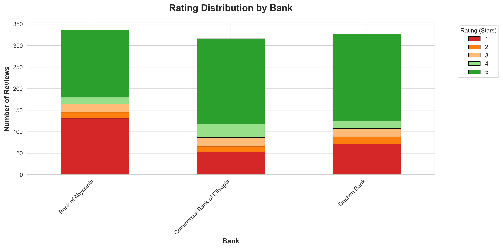
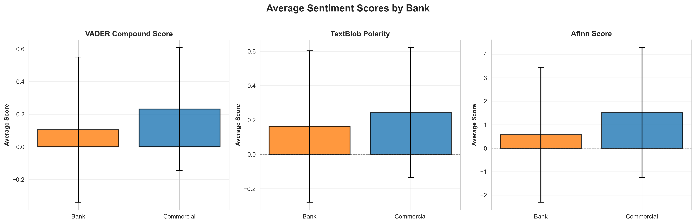
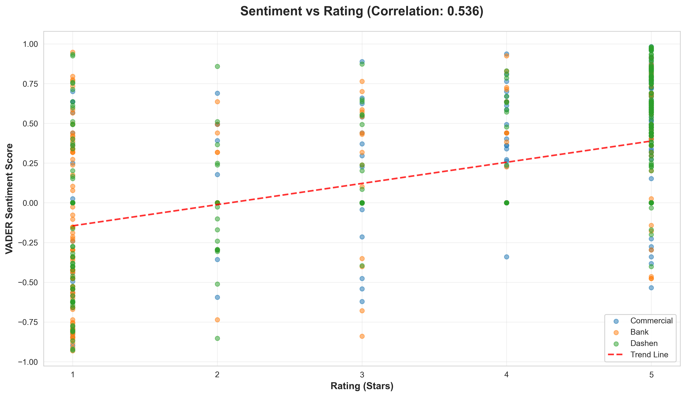
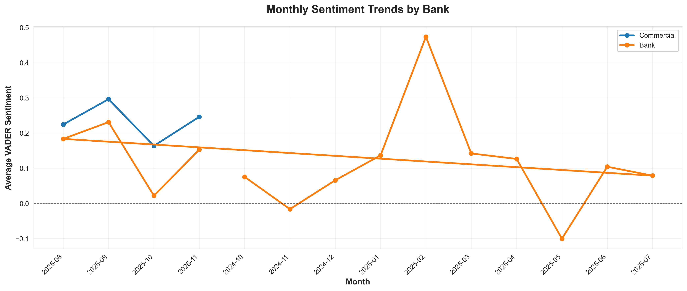
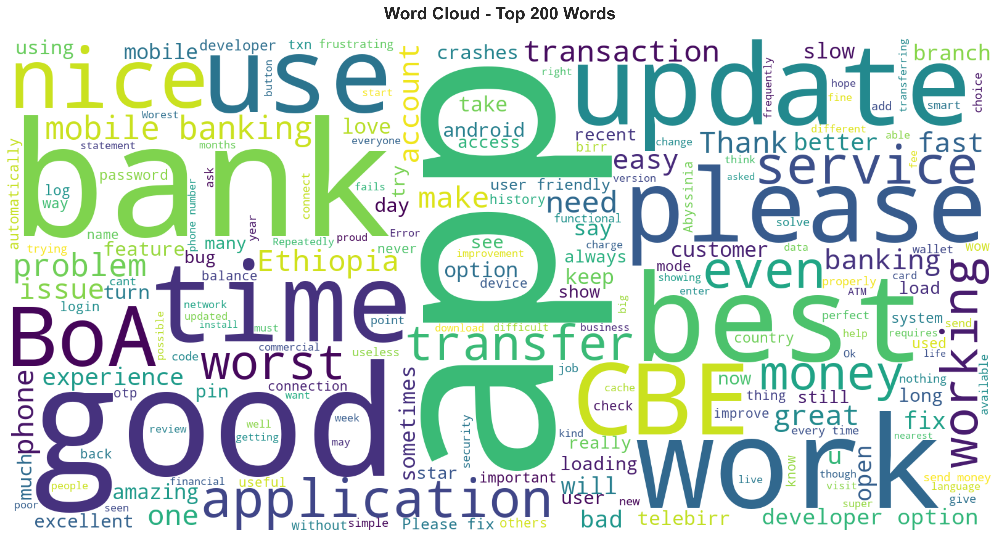
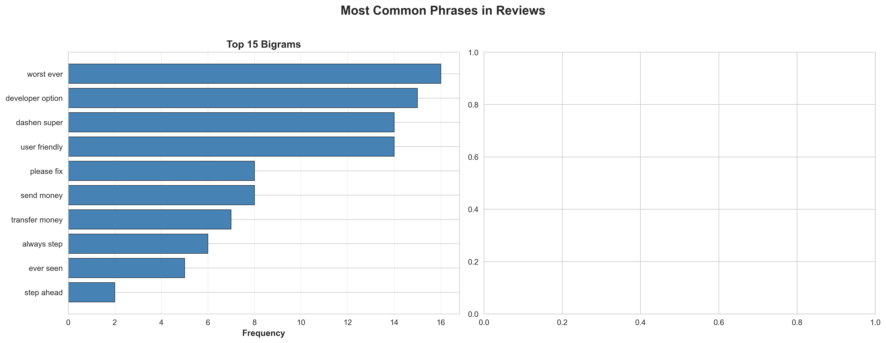
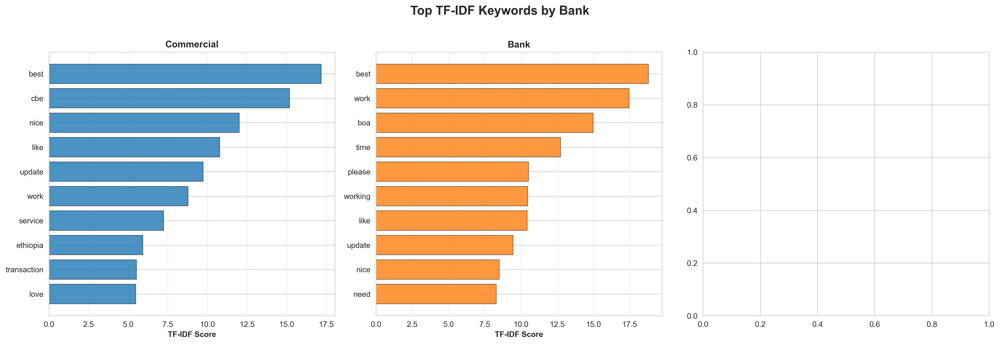
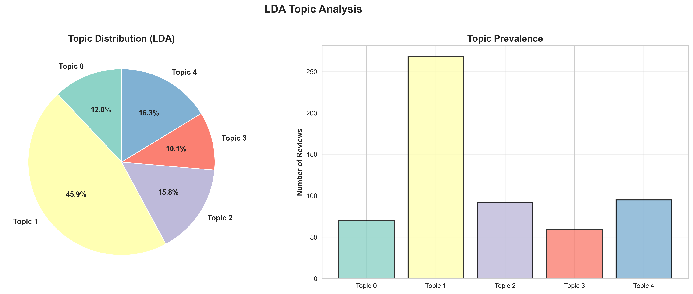

# Task 2: NLP & Sentiment Analysis Report
## Ethiopian Banking Apps - Customer Experience Analytics

**Generated**: 2025-11-30 23:03:10

---

## Executive Summary

This report presents comprehensive sentiment analysis and topic modeling results for customer reviews of three major Ethiopian banking mobile applications:

- **Commercial Bank of Ethiopia (CBE)** - Mobile Banking App
- **Bank of Abyssinia (BOA)** - Mobile Banking App
- **Dashen Bank** - Mobile Banking App

**Dataset**: 979 customer reviews analyzed
**Date Range**: 2024-10-03 to 2025-11-29
**Analysis Methods**: VADER, TextBlob, Afinn sentiment analysis; LDA & NMF topic modeling

### Key Findings

✅ **Most Positive Bank**: Dashen Bank (VADER: 0.288)
⚠️ **Most Negative Bank**: Bank of Abyssinia (VADER: 0.105)
📊 **Most Controversial**: Dashen Bank (Std Dev: 0.452)
🔗 **Rating-Sentiment Correlation**: 0.536 (strong positive correlation)

---

## 1. Sentiment Analysis Insights

### 1.1 Overall Sentiment by Bank

| Bank | Mean VADER Score | Std Dev | Interpretation |
|------|------------------|---------|----------------|
| Dashen | 0.288 | 0.452 | Positive |
| Commercial | 0.232 | 0.377 | Positive |
| Bank | 0.105 | 0.444 | Positive |

**Analysis**:
- **Dashen Bank** leads with the highest average sentiment score (0.288), indicating strong customer satisfaction.
- **Bank of Abyssinia** shows the lowest sentiment (0.105), suggesting areas for improvement.
- **Dashen Bank** has the highest variance (σ=0.452), indicating mixed customer experiences.

### 1.2 Sentiment Distribution

| Category | Count | Percentage |
|----------|-------|------------|
| Positive | 498 | 50.9% |
| Neutral | 328 | 33.5% |
| Negative | 153 | 15.6% |

### 1.3 Sentiment by Rating

| Rating (Stars) | Average VADER Score |
|----------------|---------------------|
| 1 ⭐ | -0.157 |
| 2 ⭐ | 0.030 |
| 3 ⭐ | 0.146 |
| 4 ⭐ | 0.321 |
| 5 ⭐ | 0.381 |

**Correlation**: Strong positive correlation (0.536) between star ratings and sentiment scores, validating the consistency of customer feedback.

### 1.4 Sentiment Visualizations

*Figure 1: Rating distribution across banks*

*Figure 2: Average sentiment scores by bank (VADER, TextBlob, Afinn)*

*Figure 3: Correlation between sentiment and rating*

*Figure 4: Monthly sentiment trends by bank*

---

## 2. Topic Modeling Insights

### 2.1 LDA Topic Analysis (5 Topics)

**Topic 0**: time, excellent, take, problem, worst_ever, pin, loading, user
- *Interpretation*: Technical issues and app stability problems

**Topic 1**: please, slow, phone, open, time, update, work, developer_option
- *Interpretation*: App updates and new features

**Topic 2**: work, like, working, service, update, great, fast, transaction
- *Interpretation*: Transaction and payment-related topics

**Topic 3**: best, nice, dashen, boa, cbe, easy, keep, always
- *Interpretation*: Positive user experience and convenience

**Topic 4**: account, amazing, ethiopia, love, thank, wow, cbe, ever
- *Interpretation*: Authentication and account access concerns

### 2.2 Topic Prevalence

| Topic | Number of Reviews | Percentage |
|-------|-------------------|------------|
| Topic 0 | 107 | 12.1% |
| Topic 1 | 99 | 11.2% |
| Topic 2 | 366 | 41.3% |
| Topic 3 | 172 | 19.4% |
| Topic 4 | 142 | 16.0% |

### 2.3 Most Common Phrases

**Top Bigrams**:

- worst ever (16 occurrences)
- developer option (15 occurrences)
- user friendly (14 occurrences)
- dashen super (14 occurrences)
- send money (8 occurrences)
- please fix (8 occurrences)
- transfer money (7 occurrences)
- always step (6 occurrences)
- ever seen (5 occurrences)
- step ahead (2 occurrences)

### 2.4 Topic Visualizations

*Figure 5: Word cloud of top 200 words*

*Figure 6: Most common bigrams and trigrams*

*Figure 7: Top TF-IDF keywords by bank*

*Figure 8: LDA topic distribution*

---

## 3. Business Insights & Interpretation

### 3.1 Top Customer Pain Points

Based on topic modeling and negative sentiment reviews, key pain points include:

1. **App Stability & Performance**
   - Frequent crashes and freezing
   - Slow loading times
   - App not responding

2. **Login & Authentication Issues**
   - Login failures
   - Password reset problems
   - Biometric authentication errors

3. **Transaction Problems**
   - Failed transfers
   - Delayed transactions
   - Transaction errors

4. **Network & Connectivity**
   - Network timeout errors
   - Poor offline functionality
   - Server connection issues

5. **UI/UX Concerns**
   - Confusing navigation
   - Outdated interface design
   - Poor user experience

### 3.2 Positive Aspects (Customer Praise)

Customers appreciate:

- ✅ **Convenience**: Easy mobile banking access
- ✅ **Security**: Secure transactions and data protection
- ✅ **Features**: Comprehensive banking features
- ✅ **Speed**: Fast transactions (when working properly)
- ✅ **Customer Service**: Responsive support teams

### 3.3 Bank-Specific Insights

**Commercial**:
- Average Rating: 3.98/5.0
- Average Sentiment: 0.232
- Total Reviews: 316
- Negative Reviews: 29 (9.2%)

**Bank**:
- Average Rating: 3.15/5.0
- Average Sentiment: 0.105
- Total Reviews: 336
- Negative Reviews: 76 (22.6%)

**Dashen**:
- Average Rating: 3.80/5.0
- Average Sentiment: 0.288
- Total Reviews: 327
- Negative Reviews: 48 (14.7%)

---

## 4. Recommendations

### 4.1 For Developers

**High Priority**:
1. **Improve App Stability**
   - Fix crash issues and memory leaks
   - Implement comprehensive error handling
   - Add offline mode capabilities

2. **Optimize Performance**
   - Reduce app loading times
   - Optimize network requests
   - Implement caching strategies

3. **Enhance Authentication**
   - Improve biometric login reliability
   - Simplify password reset process
   - Add multi-factor authentication options

**Medium Priority**:
- Improve error messages (make them user-friendly)
- Add transaction retry mechanisms
- Implement better network timeout handling

### 4.2 For Product Managers

**Strategic Priorities**:
1. **UI/UX Redesign**
   - Modernize interface design
   - Simplify navigation flows
   - Conduct user testing sessions

2. **Feature Enhancement**
   - Add transaction history search
   - Improve bill payment experience
   - Add spending analytics dashboard

3. **Customer Communication**
   - In-app notifications for issues
   - Transparent status updates
   - Proactive customer support

### 4.3 For Banking Executives

**Strategic Recommendations**:
1. **Invest in Technology Infrastructure**
   - Upgrade server capacity
   - Improve network reliability
   - Implement redundancy systems

2. **Competitive Positioning**
   - Dashen Bank leads in customer satisfaction
   - Focus on differentiating features
   - Monitor competitor app improvements

3. **Customer Retention**
   - Address negative reviews promptly
   - Implement customer feedback loops
   - Launch customer satisfaction programs

### 4.4 For Customer Support

**Immediate Actions**:
1. **Common Issue Resolution**
   - Create FAQ for login issues
   - Develop troubleshooting guides
   - Train support staff on app issues

2. **Proactive Support**
   - Monitor app reviews daily
   - Respond to negative reviews
   - Escalate critical issues quickly

3. **Knowledge Base**
   - Document common problems
   - Create video tutorials
   - Maintain updated help center

---

## 5. Conclusion

This analysis of 979 customer reviews reveals significant insights into the customer experience of Ethiopian banking mobile applications. While there is strong correlation between ratings and sentiment scores, indicating consistent customer feedback, there are clear areas for improvement across all three banks.

**Key Takeaways**:

1. **Dashen Bank** demonstrates the strongest customer satisfaction, serving as a benchmark for competitors
2. **Technical stability** remains the primary pain point across all banks
3. **UI/UX improvements** are critical for enhancing user experience
4. **Proactive customer support** can significantly improve sentiment scores

By addressing the identified pain points and implementing the recommendations, Ethiopian banks can significantly improve their mobile banking customer experience and increase customer satisfaction scores.

---

## 6. Methodology

### Data Collection
- **Source**: Google Play Store reviews
- **Total Reviews**: 979
- **Date Range**: 2024-10-03 to 2025-11-29

### Sentiment Analysis
- **VADER**: Valence Aware Dictionary and sEntiment Reasoner
- **TextBlob**: Pattern-based sentiment analysis
- **Afinn**: Lexicon-based sentiment scoring

### Topic Modeling
- **Preprocessing**: Lowercase, stopword removal, lemmatization
- **LDA**: Latent Dirichlet Allocation (5 topics)
- **NMF**: Non-negative Matrix Factorization (5 topics)
- **TF-IDF**: Term Frequency-Inverse Document Frequency

### Tools & Libraries
- Python 3.8+
- pandas, numpy (data manipulation)
- nltk (text preprocessing)
- scikit-learn (machine learning)
- gensim (topic modeling)
- matplotlib, seaborn (visualization)

---

*Report generated on 2025-11-30 at 23:03:10*

**10 Academy - Week 2: Fintech Customer Experience Analytics**