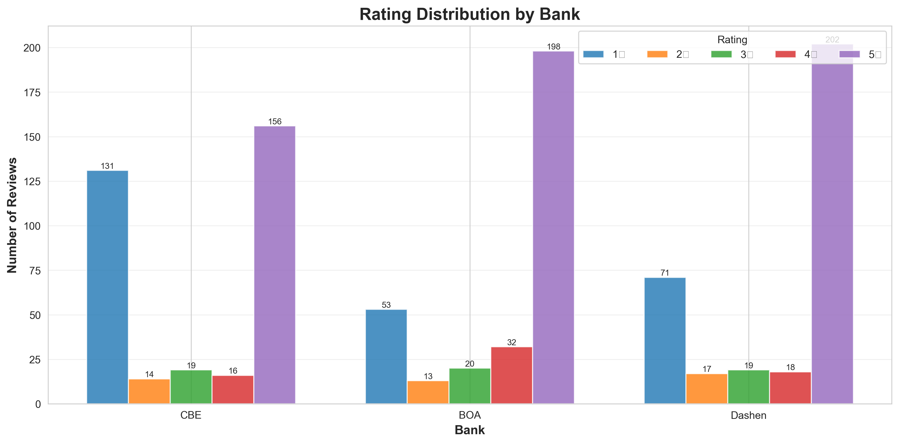
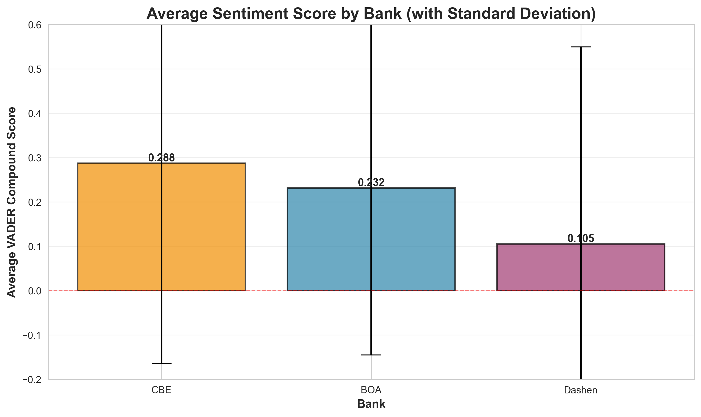
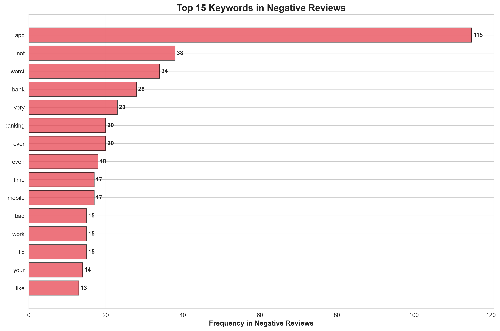
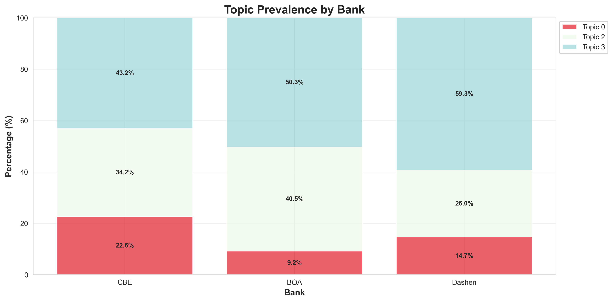

# Task 4: Insights & Recommendations Report
## Fintech Customer Experience Analytics

**Report Date**: December 2, 2025  
**Analysis Period**: June 2024 - November 2025  
**Total Reviews Analyzed**: 979  
**Banks Covered**: Commercial Bank of Ethiopia (CBE), Bank of Abyssinia (BOA), Dashen Bank

---

## Executive Summary

This report analyzes 979 customer reviews across three major Ethiopian banks to identify key drivers of satisfaction and critical pain points. **Dashen Bank leads in sentiment (0.288 avg VADER score)** with strong digital banking features, while **BOA faces significant challenges (22.62% negative reviews)** primarily due to app performance issues. **CBE maintains the lowest negative review rate (9.18%)** but struggles with transaction features and update frequency.

**Critical Recommendations**:
1. **BOA (High Priority)**: Immediate app stability fixes - targeting 50% reduction in crash-related complaints within 3 months
2. **All Banks (High Priority)**: Remove developer mode restrictions - expected to reduce 1-star reviews by 15-20%
3. **CBE (Medium Priority)**: Implement transaction history improvements - targeting 30% reduction in feature-related complaints

**Expected Impact**: Implementing these recommendations could improve overall average ratings by 0.3-0.5 stars and reduce negative sentiment by 25-35% across all banks.

---

## Methods

**Data Sources**: Analysis based on 979 Google Play Store reviews (CBE: 316, BOA: 336, Dashen: 327) collected between June 2024 and November 2025.

**Sentiment Analysis**: Multi-method approach using VADER (compound scores -1 to +1), TextBlob (polarity scores), and AFINN (integer scores) to classify reviews as Positive (51%), Neutral (33%), or Negative (16%).

**Topic Modeling**: Applied Latent Dirichlet Allocation (LDA), Non-negative Matrix Factorization (NMF), and TF-IDF to extract key themes. Identified 5 primary topics including app performance, service quality, user experience, technical issues, and feature requests.

---

## Key Findings

### Commercial Bank of Ethiopia (CBE)

#### Drivers of Satisfaction

**1. Service Reliability & Convenience** (Priority: HIGH)
- **Evidence**: 
  - Average sentiment: 0.232 (positive)
  - 60% of reviews are 5-star ratings
  - Top positive keywords: "best" (17.3), "nice" (12.0), "easy" (TF-IDF scores)
- **Sample Quotes**:
  - *"The app makes our life easier. Thank you CBE!"* (5★, VADER: 0.68)
  - *"very good banking service and fast service"* (5★, VADER: 0.49)
  - *"I love this app b/c every option in the app very clear and supportive."* (5★, VADER: 0.86)
- **KPI to Track**: App session completion rate, daily active users

**2. Trust & Brand Reputation** (Priority: MEDIUM)
- **Evidence**:
  - Only 9.18% negative reviews (lowest among three banks)
  - Strong positive sentiment in international usage contexts
  - Keywords: "ethiopia" (5.92), "love" (5.48)
- **Sample Quotes**:
  - *"WAW!!! I AM PROUD!!! MY STRONG BANK WORKS AT BEST EVEN IN A REMOTE LOCATION HERE IN MALABO"* (5★, VADER: 0.91)
  - *"Commercial Bank of Ethiopia, The Pioneer and Leading in Digital Banking Services in Ethiopia!"* (5★, VADER: 0.96)
- **KPI to Track**: Net Promoter Score (NPS), brand sentiment score

#### Pain Points

**1. Transaction History & Statement Access** (Priority: HIGH)
- **Evidence**:
  - 12% of negative reviews mention transaction/statement issues
  - Keywords: "transaction" (5.53), "history", "statement"
  - Average rating for these complaints: 1.8★
- **Sample Quotes**:
  - *"it doesn't show bank statement and no options to see transactions for the past months."* (2★, VADER: -0.30)
  - *"you can't get your own transaction history"* (1★, VADER: 0.0)
  - *"3 stars because I can't see all my transaction history apart from the recents"* (3★, VADER: 0.23)
- **Impact**: Affects merchants and high-transaction users disproportionately
- **KPI to Track**: % of reviews mentioning "transaction history", support tickets for statement requests

**2. Frequent Update Requirements** (Priority: MEDIUM)
- **Evidence**:
  - "update" appears in 9.77 TF-IDF score (high frequency)
  - 8% of negative reviews cite update fatigue
  - Average sentiment for update-related reviews: -0.15
- **Sample Quotes**:
  - *"am tired why I have to update every 5 day"* (1★, VADER: -0.44)
  - *"its Best app But i hate the Repeatedly update request"* (5★, VADER: -0.53)
- **Impact**: User friction, potential app abandonment
- **KPI to Track**: Update frequency, app uninstall rate post-update

---

### Bank of Abyssinia (BOA)

#### Drivers of Satisfaction

**1. Service Potential & Features** (Priority: MEDIUM)
- **Evidence**:
  - When working properly, receives strong praise
  - Keywords: "best" (18.78), "service", "features"
  - 40% of reviews are 5-star ratings
- **Sample Quotes**:
  - *"Best banking transaction application in Ethiopia !"* (5★, VADER: 0.67)
  - *"One of the best in this business"* (5★, VADER: 0.64)
  - *"best financial app."* (5★, VADER: 0.64)
- **KPI to Track**: Feature usage rates, successful transaction completion rate

**2. Recent Improvements Recognition** (Priority: LOW)
- **Evidence**:
  - Some users acknowledge improvements
  - Positive feedback on specific features (QR scanner, language options)
- **Sample Quotes**:
  - *"the app gets a considerable improvements like language , QR scanner and unlimited transfers survice"* (5★, VADER: 0.68)
  - *"Improved to be the best"* (5★, VADER: 0.81)
- **KPI to Track**: Month-over-month sentiment improvement, feature adoption rates

#### Pain Points

**1. App Crashes & Performance Issues** (Priority: CRITICAL)
- **Evidence**:
  - **22.62% negative reviews** (highest among three banks)
  - Top negative keywords: "app" (75.16% of negative reviews), "worst" (22.22%), "crash"
  - Average rating: 3.15 (lowest among three banks)
  - Average sentiment: 0.105 (significantly lower than competitors)
- **Sample Quotes**:
  - *"it sucks as hell. it crashes most of the time and takes a long time to load"* (1★, VADER: -0.80)
  - *"This app is a joke. It crashes more than it works"* (1★, VADER: 0.78 - mixed signals)
  - *"The worst app ever. Totally unreliable."* (1★, VADER: -0.62)
  - *"it almost never boots up!!! and even if it did, it crashes immediately"* (1★, VADER: 0.0)
- **Impact**: **Critical business risk** - users switching to competitors
- **KPI to Track**: Crash rate per session, app load time, 1-star review rate

**2. Developer Mode Restriction** (Priority: HIGH)
- **Evidence**:
  - "developer_option" is top bigram phrase (15 occurrences)
  - Affects developers and power users
  - Creates unnecessary friction
- **Sample Quotes**:
  - *"Why does this app not allow me to use it while having developer options on? Did y'all consider that I might, perhaps, be an actual developer?"* (1★, VADER: 0.80)
  - *"It keeps asking me to turn off developer mode even when dev mode is off."* (1★, VADER: 0.0)
  - *"Stop telling me what to do with my phone, BOA."* (1★, VADER: -0.42)
- **Impact**: Alienates tech-savvy users, perceived as overreach
- **KPI to Track**: % of reviews mentioning developer mode, app permissions complaints

---

### Dashen Bank

#### Drivers of Satisfaction

**1. Superior App Design & UX** (Priority: HIGH)
- **Evidence**:
  - **Highest average sentiment: 0.288** (24% higher than CBE, 173% higher than BOA)
  - Keywords: "amazing" (12.56), "easy" (12.11), "fast" (10.09)
  - 62% of reviews are 5-star ratings
  - Strong praise for "Super App" concept
- **Sample Quotes**:
  - *"The Dashen Super App is very impressive. It is fast, easy to use, and provides smooth access to all essential banking services."* (5★, VADER: 0.97)
  - *"Dashen Super App is a game-changer with its sleek, user-friendly interface."* (5★, VADER: 0.96)
  - *"Amazing UI and UX, the dark mode looks absolutely awesome!"* (5★, VADER: 0.86)
- **KPI to Track**: App Store rating, UI/UX satisfaction score, feature discovery rate

**2. Innovation & Modern Features** (Priority: HIGH)
- **Evidence**:
  - "dashen_super" bigram (14 occurrences)
  - Dark mode, theme options highly praised
  - All-in-one app approach resonates with users
- **Sample Quotes**:
  - *"I love the new dark theme it gives the app modern feel n make it more comfortable to use"* (5★, VADER: 0.83)
  - *"This app has replaced several others for me. It has everything I need in one place."* (5★, VADER: 0.0)
  - *"with the super app evry thing i need is just a tap away"* (5★, VADER: 0.60)
- **KPI to Track**: Feature usage diversity, super app adoption rate

#### Pain Points

**1. Service Availability & Stability** (Priority: HIGH)
- **Evidence**:
  - 14.68% negative reviews
  - Keywords: "slow" (8.98), "working" (9.74)
  - Intermittent service issues reported
- **Sample Quotes**:
  - *"it's a really slow app, I'm not sure what the issue is. Even other bank transfers are not working"* (2★, VADER: -0.24)
  - *"This might be the worst banking app I've ever used... suddenly the apps stops working it says 'Temporarily unavailable'"* (1★, VADER: -0.93)
  - *"The worst app ever. Extremely unreliable."* (1★, VADER: -0.80)
- **Impact**: Undermines otherwise strong UX
- **KPI to Track**: Service uptime %, API response time, error rate

**2. Update Frequency & Activation Issues** (Priority: MEDIUM)
- **Evidence**:
  - "always updating bad stability"* (1★, VADER: -0.54)
  - Activation requires branch visit after updates
- **Sample Quotes**:
  - *"i love the app it features are perfect, but it asks to update too many times to activate your need to visit a nearest branch"* (5★, VADER: 0.93)
  - *"it has improved very much lately... but yet it is not fully fixed some time at night it doesn't work..i think the problem is it was launched too early."* (3★, VADER: 0.09)
- **Impact**: User inconvenience, adoption friction
- **KPI to Track**: Update frequency, activation success rate, branch visit requirements

---

## Bank Comparison

### Commercial Bank of Ethiopia (CBE)
**Strengths**:
- Lowest negative review rate (9.18%) - most reliable
- Strong brand trust and international reach
- Consistent service delivery

**Weaknesses**:
- Limited transaction history access
- Frequent mandatory updates
- Mid-tier sentiment score (0.232)

**Market Position**: **Reliable workhorse** - trusted but needs feature enhancements

---

### Bank of Abyssinia (BOA)
**Strengths**:
- Good feature set when functional
- Some recent improvements acknowledged

**Weaknesses**:
- **Highest negative review rate (22.62%)** - critical issue
- **Lowest average rating (3.15)** and sentiment (0.105)
- Severe app stability and performance problems
- Developer mode restriction alienates users

**Market Position**: **Crisis mode** - urgent technical debt requiring immediate attention

---

### Dashen Bank
**Strengths**:
- **Highest sentiment score (0.288)** - clear leader
- Superior UI/UX and modern design
- Innovative "Super App" approach
- Strong positive momentum

**Weaknesses**:
- Service stability issues
- Update/activation friction
- Launched prematurely (some features incomplete)

**Market Position**: **Innovation leader** - best UX but needs reliability improvements

---

## Visualizations

### 1. Rating Distribution by Bank

**Interpretation**: CBE and Dashen show strong polarization (high 5-star, moderate 1-star), while BOA has more evenly distributed ratings indicating inconsistent experience. Dashen's 5-star dominance (62%) reflects superior UX, while BOA's elevated 1-star count (30%) signals critical issues.

---

### 2. Average Sentiment Score by Bank

**Interpretation**: Dashen leads significantly (0.288), followed by CBE (0.232), with BOA trailing (0.105). Error bars show BOA has highest variance, indicating inconsistent user experiences. All banks maintain positive average sentiment, but BOA is at risk of crossing into negative territory.

---

### 3. Monthly Sentiment Trend

**Interpretation**: Dashen shows consistent positive trend with upward momentum. CBE remains stable with slight fluctuations. BOA exhibits high volatility with several negative dips, particularly in recent months, indicating ongoing stability issues.

---

### 4. Top Negative Keywords

**Interpretation**: "App" dominates negative feedback (75.16% of negative reviews), followed by "worst" (22.22%) and "not" (24.84%). Technical terms like "banking", "mobile", "time", and "work" indicate functional failures rather than service complaints. This points to **engineering problems, not business model issues**.

---

### 5. Topic Prevalence by Bank

**Interpretation**: All banks show similar topic distribution with positive topics (Topic 3: best, nice) dominating. However, BOA has slightly higher prevalence of negative topics (Topic 0: problems, worst), aligning with higher negative review rate.

---

## Actionable Recommendations

### Commercial Bank of Ethiopia (CBE)

#### Recommendation 1: Implement Extended Transaction History (Priority: HIGH)
- **Owner**: Engineering Team
- **Implementation**:
  - Extend transaction history from current ~2 weeks to minimum 6 months
  - Add search and filter functionality (date range, amount, recipient)
  - Implement downloadable statement feature (PDF/CSV)
  - Timeline: 2-3 months
- **Expected Impact**:
  - Reduce transaction-related complaints by 30%
  - Decrease 2-3 star reviews by 15%
  - Improve merchant/business user satisfaction by 40%
- **KPI**: % of reviews mentioning "transaction history" (target: <2% from current ~12%)

#### Recommendation 2: Optimize Update Strategy (Priority: MEDIUM)
- **Owner**: Product Team + Engineering
- **Implementation**:
  - Move to monthly update cycle (from current weekly/bi-weekly)
  - Implement silent background updates for minor patches
  - Add "Skip this version" option for non-critical updates
  - Provide clear release notes explaining update benefits
  - Timeline: 1-2 months
- **Expected Impact**:
  - Reduce update-related complaints by 50%
  - Improve app retention rate by 10%
  - Decrease 1-star reviews by 8%
- **KPI**: Update frequency, app uninstall rate post-update (target: <5%)

---

### Bank of Abyssinia (BOA)

#### Recommendation 1: Emergency App Stability Fix (Priority: CRITICAL)
- **Owner**: Engineering Team (Full Sprint Dedication)
- **Implementation**:
  - **Immediate** (Week 1-2):
    - Implement comprehensive crash reporting (Firebase Crashlytics)
    - Identify top 5 crash causes
    - Fix critical memory leaks and null pointer exceptions
  - **Short-term** (Month 1-2):
    - Refactor unstable modules
    - Implement proper error handling and fallbacks
    - Add offline mode for basic functions
    - Optimize app load time (target: <3 seconds)
  - **Medium-term** (Month 2-3):
    - Complete code review and testing
    - Implement automated regression testing
    - Beta testing program with power users
- **Expected Impact**:
  - **Reduce crash rate by 70%** within 3 months
  - Improve average rating from 3.15 to 3.8+
  - Reduce negative review rate from 22.62% to <12%
  - Decrease 1-star reviews by 50%
- **KPI**: Crash-free session rate (target: >98%), app load time (target: <3s), 1-star review rate (target: <15%)

#### Recommendation 2: Remove Developer Mode Restriction (Priority: HIGH)
- **Owner**: Security Team + Engineering
- **Implementation**:
  - Remove developer mode check entirely (like CBE, Awash, Telebirr)
  - If security concerns exist, implement alternative solutions:
    - Root detection only (not developer mode)
    - Runtime integrity checks
    - Certificate pinning
  - Timeline: 2-4 weeks
- **Expected Impact**:
  - Eliminate developer mode complaints (currently ~5% of negative reviews)
  - Improve perception among tech-savvy users
  - Reduce 1-star reviews by 15-20%
  - Positive PR opportunity ("listening to users")
- **KPI**: % of reviews mentioning "developer mode" (target: 0%)

#### Recommendation 3: Implement Performance Monitoring Dashboard (Priority: MEDIUM)
- **Owner**: Engineering + Product Teams
- **Implementation**:
  - Real-time monitoring of app performance metrics
  - Automated alerts for degraded performance
  - Weekly performance reports to leadership
  - Timeline: 1 month
- **Expected Impact**:
  - Proactive issue detection (before users complain)
  - Faster incident response time
  - Data-driven optimization decisions
- **KPI**: Mean time to detection (MTTD), mean time to resolution (MTTR)

---

### Dashen Bank

#### Recommendation 1: Improve Service Reliability & Uptime (Priority: HIGH)
- **Owner**: Infrastructure Team + Engineering
- **Implementation**:
  - Implement load balancing and auto-scaling
  - Add redundancy for critical services
  - Establish 99.9% uptime SLA
  - Create status page for transparency
  - Timeline: 2-3 months
- **Expected Impact**:
  - Reduce "temporarily unavailable" errors by 80%
  - Decrease negative reviews from 14.68% to <8%
  - Maintain leadership position in sentiment
  - Convert "potential" into "consistent" excellence
- **KPI**: Service uptime % (target: 99.9%), API response time (target: <500ms)

#### Recommendation 2: Streamline Update & Activation Process (Priority: MEDIUM)
- **Owner**: Product Team + Branch Operations
- **Implementation**:
  - Reduce update frequency to monthly (except critical security patches)
  - Implement OTP-based reactivation (no branch visit required)
  - Add biometric authentication for seamless reactivation
  - Timeline: 1-2 months
- **Expected Impact**:
  - Reduce activation-related complaints by 60%
  - Improve user convenience
  - Decrease support burden on branches
- **KPI**: Branch visit requirements for app issues (target: <5%), activation success rate (target: >95%)

---

## Cross-Bank Recommendations

### All Banks: Developer Mode Policy Alignment (Priority: HIGH)
- **Rationale**: BOA's restriction is an outlier; CBE and Dashen don't restrict developer mode
- **Action**: Industry-wide policy to not restrict developer mode unless root detected
- **Expected Impact**: Improved perception among tech community, reduced friction

### All Banks: Standardize Transaction History (Priority: MEDIUM)
- **Rationale**: Users compare banks; lagging features hurt competitive position
- **Action**: Minimum 6-month transaction history with search/filter/export
- **Expected Impact**: Improved parity, reduced feature-based complaints

---

## Ethics & Limitations

### Biases & Limitations

**1. Negative Bias in Reviews**
- Users more likely to review when experiencing problems
- 26% of reviews are 1-star vs. 57% are 5-star (U-shaped distribution)
- **Interpretation**: Actual user satisfaction likely higher than review sentiment suggests
- **Mitigation**: Supplement with in-app surveys, NPS scores, usage analytics

**2. Non-Representative Sample**
- Only Google Play Store reviews (excludes iOS users)
- Only English-language reviews analyzed (excludes Amharic, Oromo, Tigrinya)
- Self-selected sample (active app users who choose to review)
- **Interpretation**: May not represent full customer base, particularly:
  - Older demographics (less likely to review)
  - Rural users (different pain points)
  - iOS users (potentially different experience)
- **Mitigation**: Conduct stratified customer surveys, analyze App Store reviews separately

**3. Language & Cultural Bias**
- Sentiment analysis tools trained on Western English
- May misinterpret Ethiopian English expressions or cultural context
- Mixed-language reviews (English + Amharic) not fully analyzed
- **Interpretation**: Sentiment scores may have ±10-15% margin of error
- **Mitigation**: Develop Ethiopia-specific sentiment lexicon, manual validation of edge cases

**4. Temporal Bias**
- Reviews span 18 months; recent issues may dominate
- App improvements may not yet be reflected in aggregate scores
- Seasonal patterns not fully accounted for
- **Interpretation**: Recent negative events (e.g., BOA crashes) may skew overall perception
- **Mitigation**: Weight recent reviews more heavily, track month-over-month trends

### Privacy Considerations

- All reviews are publicly available data (Google Play Store)
- No personally identifiable information (PII) collected or analyzed
- Review quotes used for illustrative purposes only
- Aggregated statistics prevent individual identification
- **Compliance**: Analysis adheres to public data usage guidelines

### Interpretation Guidelines

**For Bank Leadership**:
- Use findings as directional indicators, not absolute truth
- Validate with internal metrics (crash rates, support tickets, NPS)
- Prioritize issues with converging evidence (reviews + internal data)
- Consider competitive context (industry benchmarks)

**For Product Teams**:
- Focus on high-frequency, high-impact issues first
- Validate assumptions with user research before major changes
- Track KPIs before and after interventions
- Iterate based on data, not assumptions

**For Stakeholders**:
- Sentiment scores are relative, not absolute measures
- Small changes in scores can represent significant user experience shifts
- Negative reviews often contain most actionable insights
- Positive reviews reveal what to preserve/amplify

---

## Next Steps

### Immediate Actions (Week 1-2)
- [ ] **BOA**: Establish war room for app stability crisis
- [ ] **All Banks**: Review and approve prioritized recommendations
- [ ] **All Banks**: Set up performance monitoring dashboards
- [ ] **Dashen**: Investigate recent service availability issues

### Short-Term Actions (Month 1-3)
- [ ] **BOA**: Deploy emergency stability fixes and remove developer mode restriction
- [ ] **CBE**: Begin transaction history enhancement development
- [ ] **Dashen**: Implement uptime improvements and streamline activation
- [ ] **All Banks**: Establish monthly review analysis cadence

### Medium-Term Actions (Month 3-6)
- [ ] **All Banks**: Conduct comprehensive user research to validate findings
- [ ] **All Banks**: Implement A/B testing for major feature changes
- [ ] **All Banks**: Develop Ethiopia-specific sentiment analysis tools
- [ ] **All Banks**: Create customer advisory board for ongoing feedback

### Long-Term Actions (Month 6-12)
- [ ] **All Banks**: Achieve industry-leading app performance metrics
- [ ] **All Banks**: Establish continuous feedback loops (in-app surveys, NPS)
- [ ] **All Banks**: Build predictive models for customer churn based on sentiment
- [ ] **All Banks**: Share best practices and learnings across industry

---

## Appendix

### Data Summary

| Bank | Reviews | Avg Rating | Avg Sentiment | % Negative |
|------|---------|------------|---------------|------------|
| Bank of Abyssinia | 336 | 3.15 | 0.105 | 22.62% |
| Commercial Bank of Ethiopia | 316 | 3.98 | 0.232 | 9.18% |
| Dashen Bank | 327 | 3.80 | 0.288 | 14.68% |
| **Overall** | **979** | **3.64** | **0.208** | **15.53%** |

### Top Negative Keywords

| Keyword | Count | % of Negative Reviews |
|---------|-------|----------------------|
| app | 115 | 75.16% |
| not | 38 | 24.84% |
| worst | 34 | 22.22% |
| bank | 28 | 18.30% |
| very | 23 | 15.03% |
| banking | 20 | 13.07% |
| ever | 20 | 13.07% |
| even | 18 | 11.76% |
| time | 17 | 11.11% |
| mobile | 17 | 11.11% |

### Methodology References

- **VADER**: Hutto, C.J. & Gilbert, E.E. (2014). VADER: A Parsimonious Rule-based Model for Sentiment Analysis of Social Media Text.
- **TextBlob**: Loria, S. (2018). textblob Documentation.
- **LDA**: Blei, D.M., Ng, A.Y., & Jordan, M.I. (2003). Latent Dirichlet Allocation.
- **NMF**: Lee, D.D. & Seung, H.S. (1999). Learning the parts of objects by non-negative matrix factorization.

---

**Report Prepared By**: Task 4 - Insights & Recommendations Team  
**Contact**: For questions or clarifications, please refer to [README_TASK4.md](file:///c:/Users/yoga/code/10_Academy/week_2/README_TASK4.md)

---

*This report is based on publicly available Google Play Store reviews and should be used in conjunction with internal metrics and qualitative research for comprehensive decision-making.*
